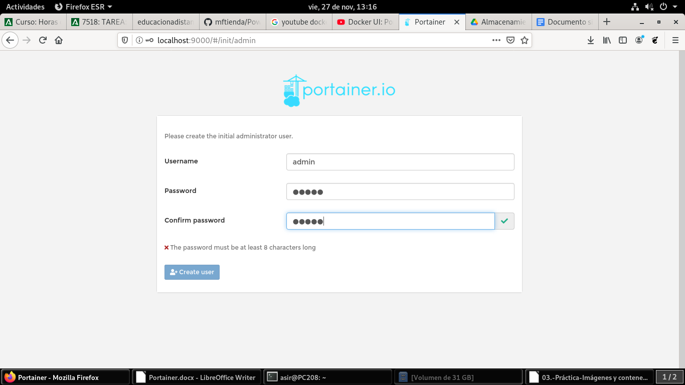
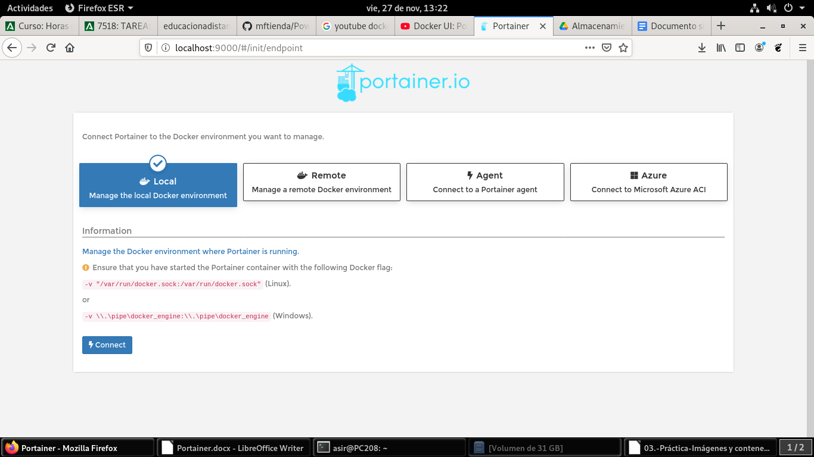

# Acceso

Una vez levantado el contenedor portainer toca acceder y crear sesión, para acceder pondremos en el navegador localhost:9000

Una vez logeados nos pedira como queremos administrar nuestros contenedores, elegimos en este caso local ya que nuestros contenedores se encuentran ennuestro equipo local

