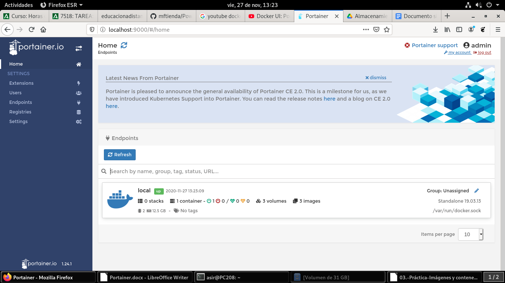
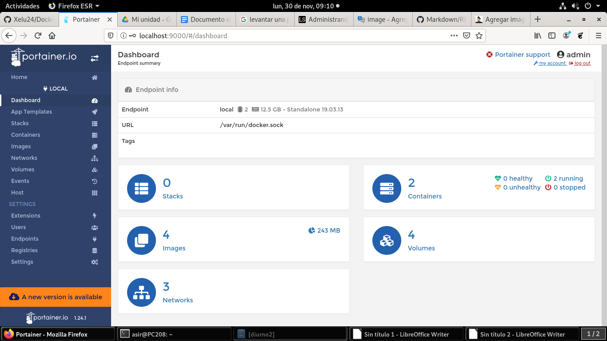

# Panel de Control

Una vez logueados en Docker Portainer pinchamos donde pone local que es donde le hemos indicado que tenemos nuestros contenedores.

Una vez que hemos pinchado en local nos cambiara el panel de control de la izquierda mostrandonos todo lo necesario para administrar nuestros contenedores red,volumenes,imagenes,los contenedores creados,etc...

