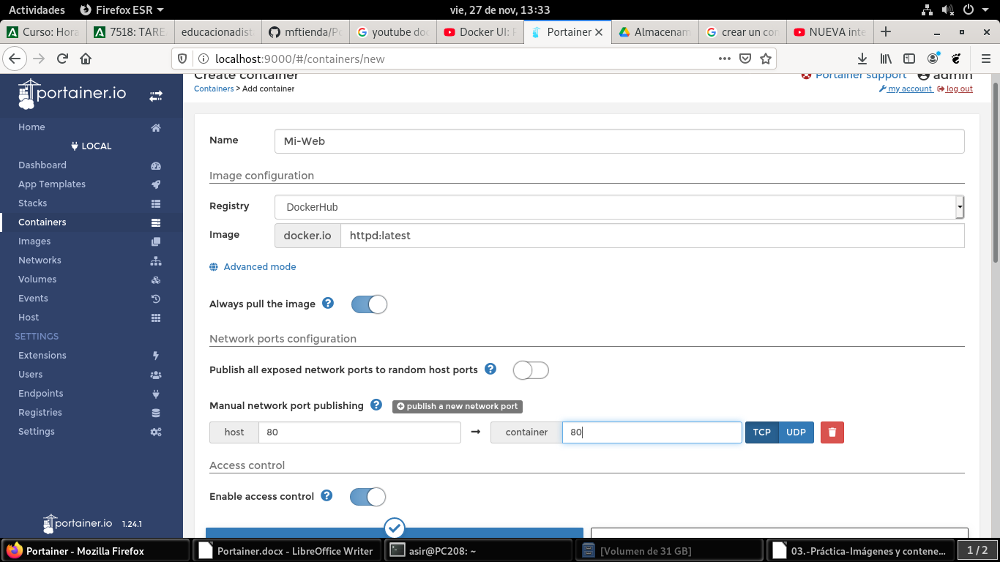
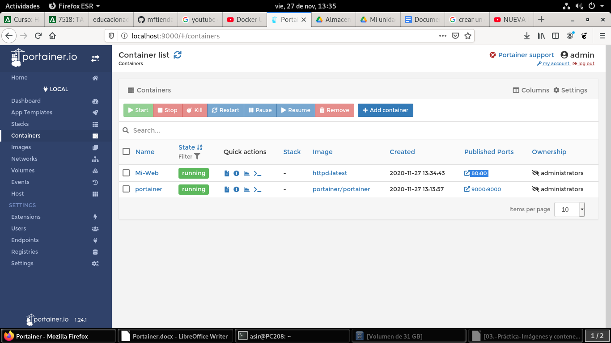
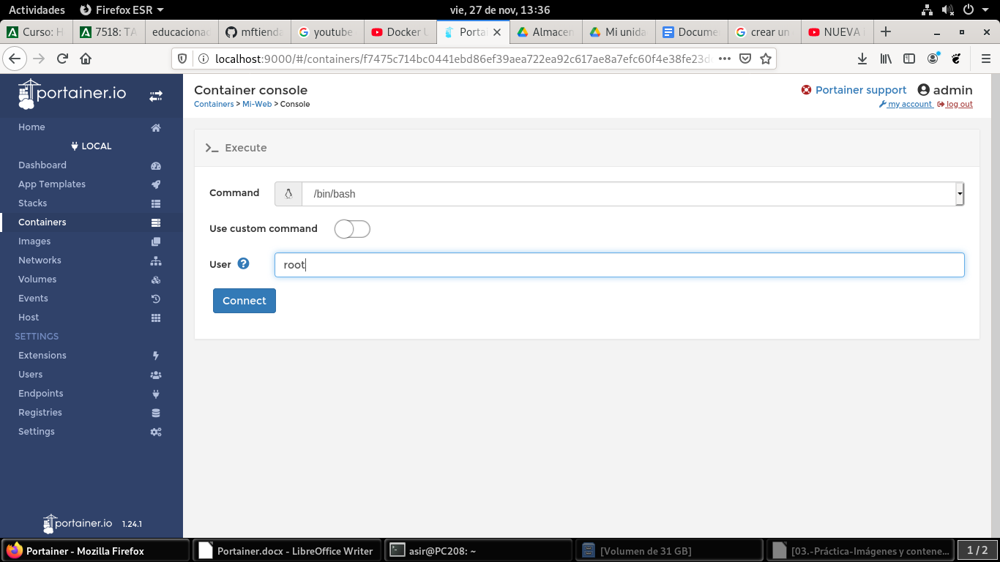
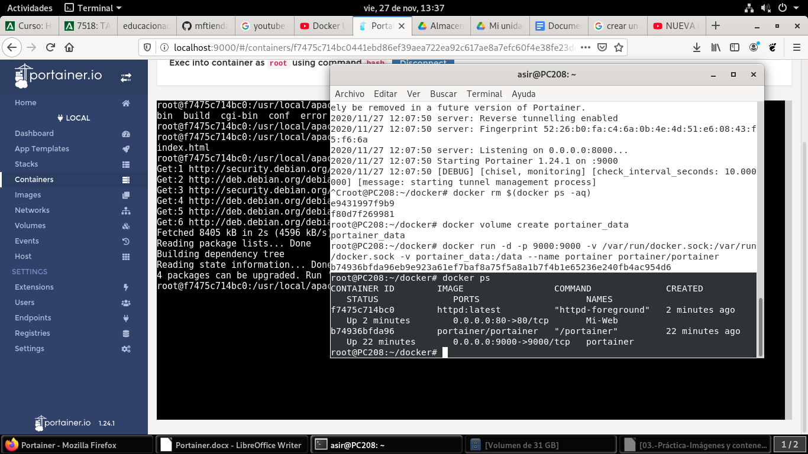
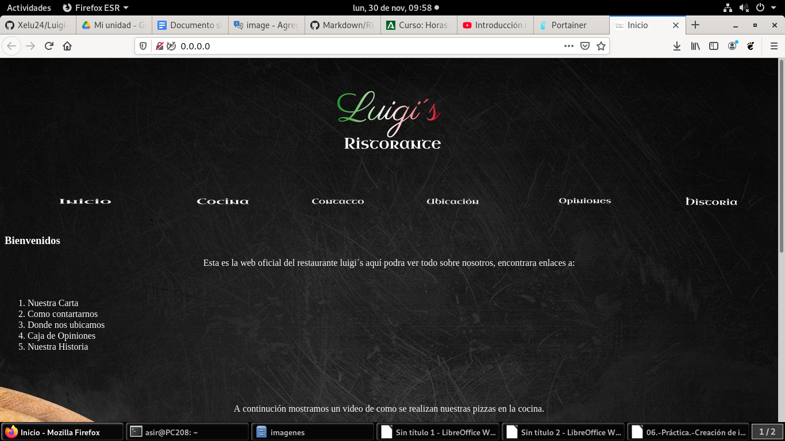

# Creación de contenedor con httpd

Lo primero que haremos será descargarnos la imagen httpd para ello pinchamos en el panel de control images y en donde pone Image introducimos el nombre de la imagen correspondiente

Una vez descargada la imagen procedemos a la creación del contenedor seleccionando la opción Containers en el panel de control, una vez dentro, le damos a Add Container y dentro le damos el nombre que queramos y un puerto de salida.

Portainer nos dara la opción de abrir la consola para administrar el contenedor le daremos a esta opción para personalizar nuestro contenedor.

